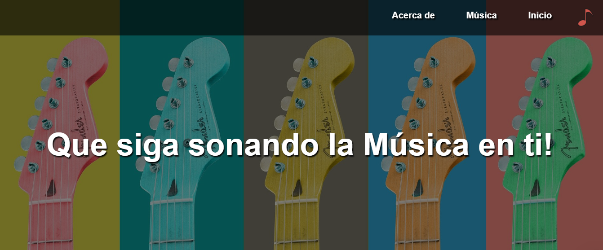

# 🎵 Página Web de Música



Este es un proyecto de una página web básica de música desarrollada con **HTML** y **CSS (Flexbox)**. Su objetivo es proporcionar una experiencia amigable y atractiva para los amantes de la música.

## 🚀 Características

- 🌟 Diseño responsivo con **Flexbox**
- 🎼 Secciones destacadas: **Artistas, Música y Acerca de**
- 🎨 Efectos de sombra y estilo moderno
- 📱 Es solo a efectos de mostrar el Home

## 📂 Estructura del Proyecto

```
Pagina_web_basic_flexbox/
│── index.html         # Página principal
│── css/
│   ├── style.css      # Archivo de estilos
│── img/
│   ├── header.jpg     # Imagen de cabecera
│   ├── nota-musical.png
│   ├── sonreir.png
│   ├── musica.png
│   ├── cantando.png
└── README.md
```

## 📌 Tecnologías Utilizadas

- **HTML5**
- **CSS3 (Flexbox)**

## 📬 Contacto

Si tienes alguna sugerencia o pregunta, no dudes en contactarme. 😊
